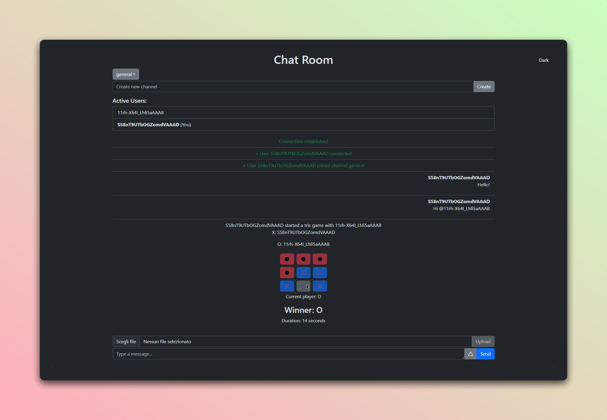

# Chat Room



[](https://nodejs.org/)
[](https://expressjs.com/)
[](https://socket.io/)
[](https://ejs.co/)
[](https://opensource.org/licenses/MIT)

## Overview

Chat Room is a real-time chat application built with Node.js, Express, and Socket.io. It allows users to join different channels, send messages, and even play mini-games like Tic-Tac-Toe and Rock-Paper-Scissors within the chat interface.

## Features

- **Real-Time Messaging**: Send and receive messages instantly across different channels.
- **Multiple Channels**: Join and switch between channels like `general`, `random`, and `tech`, or create your own.
- **User Activities**: Engage in mini-games like Tic-Tac-Toe and Rock-Paper-Scissors with other users in the chat.
- **Markdown Support**: Format messages using Markdown.
- **File Sharing**: Upload and share files within the chat.
- **Typing Indicator**: See when other users are typing.
- **Message Rate Limiting**: Prevent spamming with a message rate limit feature.

## Installation

### Prerequisites

Ensure you have the following installed:

- [Node.js](https://nodejs.org/) v18 or higher
- [npm](https://www.npmjs.com/) v7 or higher

### Steps

1. **Clone the repository:**

   ```bash
   git clone https://github.com/EXELVI/chat-room.git
   ```

2. **Navigate to the project directory:**
   ```bash
   cd chat-room
   ```
3. **Install the dependencies:**

   ```bash
   npm install
   ```

4. **Start the server:**

   ```bash
   npm start
   ```

5. **Access the application:**
   Navigate to http://localhost:3000 to start using the chat room.

## Usage

- **Join a Channel**: Users are automatically connected to the general channel upon joining. To switch channels, use the channel menu.
- **Send a Message**: Type your message in the input box and press enter to send. You can use Markdown for formatting.
- **Play a Game**: Initiate a game by typing a user mention and pressing the game button. Select a game to play.
- **File Upload**: Click the upload icon to share files with users in your current channel.

## Contributing

Contributions are welcome! Feel free to raise an issue or submit a pull request.
